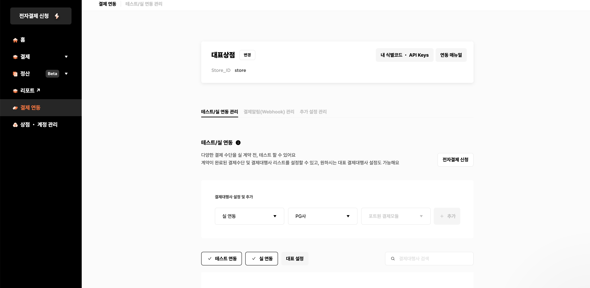
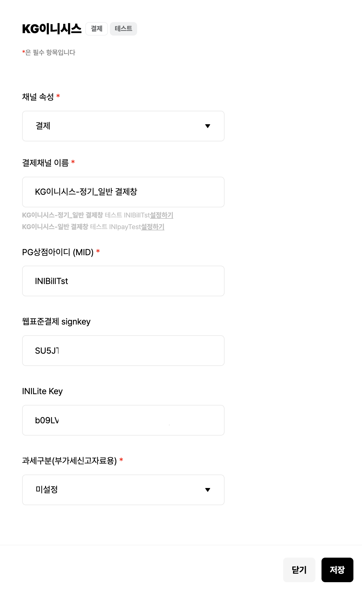

# 2. 포트원 결제 요청

## 1. 포트원 통합 결제 솔루션

[포트원](https://portone.io/korea/ko)  
[결제 연동하기](https://portone.gitbook.io/docs/console/guide/connect)  
[API Keys](https://portone.gitbook.io/docs/console/guide/api-keys)  
[인증결제 연동하기](https://portone.gitbook.io/docs/auth/guide)  
[JavaScript SDK](https://portone.gitbook.io/docs/sdk/javascript-sdk)  

### 포트원

여러 PG사를 하나의 깔끔한 API로 사용할 수 있게 해주는 통합 결제 솔루션  
예전에는 `아임포트`라는 이름으로 서비스 

V2가 더 좋아지긴 했지만 API Key를 신청해야 하고 아직 베타버전이기 때문에 여기서는 V1 사용 

### 장점 

* 가볍게 무료로 시작할 수 있음(사업자가 아니어도 됨)
* 복잡한 심사 과정을 거치지 않아도 바로 결제 기능을 테스트할 수 있음
* 여러 결제 수단을 추가할 수 있음 
* 많은 기업에서 사용 중

### 인증결제 프로세스

인증결제 : 흔히 쓰는 것    
비인증결제 : 정기 결제 등

1. 결제 요청 (F/E에서 요청) → 우리가 자주 보는 결제창이 뜸 (🏢 포트원에 요청) 
2. 결제 결과 확인 (F/E에서 결과 받음) (🏢 포트원에 요청)
3. 결제 금액 위변조 검증 → B/E로 결제 결과를 전송하면 B/E에서 처리 (👩🏻‍💻 백엔드에 요청)
4. 결제 완료 → B/E에서 성공하면 F/E는 주문 완료 페이지로 이동 (👩🏻‍💻 백엔드에 요청)


### 사용 방법 

포트원에 가입하고, 관리자 콘솔로 가서 기본적인 세팅을 진행

#### 1. 결제 연동 > 결제대행사 설정 및 추가





1. 실 연동, 테스트 중 선택 → 여기서는 **테스트** 선택
2. PG사 선택 → 원하는 것 아무거나
3. **아임포트 결제모듈**을 누르면 선택한 PG사에 따라 적절한 선택지가 나옴
4. **+ 추가** 버튼을 누르면 상세 정보를 입력할 수 있는데, 테스트라서 그냥 **저장** 버튼을 클릭
5. **PG상점아이디** 항목을 클릭하면 해당 정보가 복사됨 ⇒ 챙겨둘 것 ✅

💡 PG사를 **카카오페이**로 선택하면 부담 없이 테스트할 수 있기 때문에 강력 추천

#### 2. 상점 ・ 계정 관리 > 내 식별코드 ・ API Keys

**가맹점 식별코드** 부분을 클릭하면 해당 코드가 클립보드로 복사됨 ⇒ 챙겨둘 것 ✅

### PG 

PG란 **Payment Gateway**의 약자로, 지불의 출입구 역할을 하는 **온라인 결제대행사**  
PG사에서는 사업자를 대신하여 카드사와 계약을 맺고 결제와 정산을 대행해줌  

<br>

## 2. 결제 요청

포트원 V2 SDK가 베타로 출시됐지만, 여기서는 V1을 사용

* V2 : npm, script로 추가 
* V1 : script로만 추가 

### `index.html` 파일에 스크립트 태그 추가

```html
<script src="https://cdn.iamport.kr/v1/iamport.js"></script>
```

* 순서는 상관 없지만, 강의에서는 맨 위에 배치   

### `main.tsx` 파일의 main 함수에서 가맹점 식별 코드를 세팅

포트원 사용방법에서 챙겨둔 2가지 코드를 이용 

* 타입을 지정해주는 방법
* Reflect.get으로 가져오는 방법 → 여기서는 이 방법 

```tsx
Reflect.get(window, 'IMP').init('가맹점_식별코드');
```

🚨 해당 초기화 작업을 **1회 이상** 처리되지 않도록 주의      
⇒ main에서 처리하는 이유 

### 환경 변수 세팅  

[parcel - 환경 변수](https://ko.parceljs.org/env.html)

이런 정보는 환경변수를 활용하면 훨씬 더 좋음   
`.env` 파일을 만들어서 개발할 때 사용할 환경변수를 관리   
하는 김에 (지금까지 사용하지 않았던) `API_BASE_URL`도 같이 잡아줄 것 

```
API_BASE_URL=https://shop-demo-api-03.fly.dev
PORTONE_IMP=<가맹점 식별코드>
PORTONE_PG_CODE=<PG사 코드>.<PG상점아이디>
```

PG사 코드는 포트원 문서를 참고해서 작성 - [결제요청 파라미터](https://portone.gitbook.io/docs/sdk/javascript-sdk/payrq)  

* .env : 글로벌하게 사용
* .env.local : 개발할 때 사용

#### 가맹점 식별 코드를 세팅할 때 환경변수 사용 

```tsx
Reflect.get(window, 'IMP').init(process.env.PORTONE_IMP);
```

⚠️ Parcel 서버 재시작하기 

### `PaymentService` 생성 

* src/services

Axios와 마찬가지로 코드에서 포트원을 그대로 사용하지 않도록, `PaymentService`를 생성 

```tsx
const PG_CODE = process.env.PORTONE_PG_CODE || ''; // 없으면 에러 발생 

type Product = {
  name: string; // 'ㅇㅇ 외 2건' 같은 주문 상품명  
  price: number;
};

type Buyer = {
  name: string;
  email: string;
  phoneNumber: string;
  address: string;
  postalCode: string;
};

type PaymentResponse = {
  success: boolean;
  error_code: string;
  error_msg: string;
  imp_uid: string | null;
  merchant_uid: string;
}

export default class PaymentService {
  instance = Reflect.get(window, 'IMP');

  async requestPayment({ merchantId, product, buyer }: {
    merchantId: string;
    product: Product;
    buyer?: Buyer;  // 이번 프로젝트에서는 사용 안 함 
  }): Promise<{
    merchantId: string;
    transactionId: string;
  }> {
    return new Promise((resolve, reject) => {
      this.instance.request_pay({
        pg: PG_CODE,
        pay_method: 'card',
        merchant_uid: merchantId,
        name: product.name,
        amount: product.price,
        buyer_email: buyer?.email,
        buyer_name: buyer?.name,
        buyer_tel: buyer?.phoneNumber,
        buyer_addr: buyer?.address,
        buyer_postcode: buyer?.postalCode,
      }, (response: PaymentResponse) => {
        if (response.success) {
          resolve({
            merchantId: response.merchant_uid,
            transactionId: response.imp_uid ?? '',
          });
        } else {
          reject(Error(response.error_msg));
        }
      });
    });
  }
}

export const paymentService = new PaymentService();
```

* 구매자 정보를 알면 관리자 페이지에서 주문 취소 등을 처리해줄 수 있음

### 컴포넌트에서 쉽게 쓸 수 있도록 `usePayment` hook 생성 

```tsx
export default function usePayment(cart: Cart) {
  return {
    async requestPayment() {
      const now = new Date();
      const date = now.toISOString().slice(0, 10).replace(/-/g, '');
      const time = now.getTime();
      const nonce = Math.random().toString().slice(-5);
      const merchantId = `ORDER-${date}-${time}${nonce}`;

      const result = await paymentService.requestPayment({
        merchantId,
        product: {
          name: cart.lineItems[0].product.name,
          price: cart.totalPrice,
        },
      });

      return result;
    },
  };
}
```

* merchantId : payment ID 등으로 사용, 유니크해야 함 
* 주로 날짜를 넣어서 사용
* 대규모 서비스의 경우 밀리세컨드 단위까지 겹칠 수 있기 때문에 nonce(랜덤 임시 값) 사용
* slice(-5)는 뒤에서부터 처리
* 특별한 문제가 없을 것이라는 전제로 작성한 코드(장바구니 아이템이 없는 경우는 이미 걸러졌다고 가정) 

### `PaymentButton` 컴포넌트 생성 

* src/components/new-order/OrderForm 에 `<PaymentButton />` 추가 

```tsx
const Container = styled.div`
  p {
    margin-block: 2rem;
    color: ${(props) => props.theme.colors.primary};
    font-size: 2rem;
    font-weight: bold;
  }
`;

type PaymentButtonProps = {
  cart: Cart;
};

export default function PaymentButton({ cart }: PaymentButtonProps) {
  const navigate = useNavigate();

  const [{ valid }] = useOrderFormStore();

  const { requestPayment } = usePayment(cart);

  const [error, setError] = useState('');

  const handleClick = async () => {
    setError('');

    try {
      const { merchantId, transactionId } = await requestPayment();

      // TODO: B/E로 주문 및 결제 정보 전달
        // 주문 정보는 OrderForm에 들어가 있음 

      navigate('/order/complete');
    } catch (e) {
      if (e instanceof Error) {
        setError(e.message);
      }
    }
  };

  return (
    <Container>
      <Button onClick={handleClick} disabled={!valid}>
        결제
      </Button>
      {error && (
        <p>{error}</p>
      )}
    </Container>
  );
}
```

* 에러일 경우의 폰트 색상이나 사이즈를 조절할 수 있음
* 에러 컴포넌트를 따로 빼도 됨 

> 🚧 **테스트 결제**   
> 
> 백엔드로 정보 전달하는 로직이 미구현 상태이지만 작동은 함  
> QR 코드가 뜨고 스마트폰으로 스캔이 가능    
> 다른 PG사로 하면 직접 카드를 연결해서 사용해볼 수 있음 
