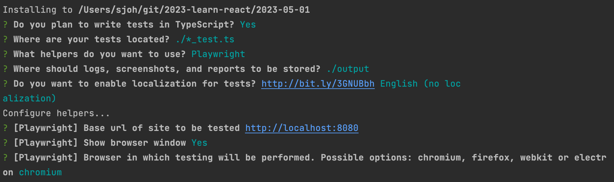

# 4. Playwright

## 1. E2E(End to End) Test

[What is End-to-End (E2E) Testing?](https://katalon.com/resources-center/blog/end-to-end-e2e-testing)

End To End 테스트    
애플리케이션의 흐름을 처음부터 끝까지 테스트하는 것

응용 프로그램 흐름이 예상대로 작동하는지 확인하기 위해 처음부터 끝까지 전체 소프트웨어 제품을 테스트하는 방법    
제품의 시스템 종속성을 정의하고 통합된 모든 부분이 예상대로 함께 작동하도록 함  
주요 목적은 실제 사용자 시나리오를 시뮬레이션하고, 통합 및 데이터 무결성을 위해 테스트 중인 시스템과 해당 구성 요소의 유효성을 검사하여 최종 사용자의 경험에서 테스트하는 것

### 장점

* 테스트 범위 확장
* 애플리케이션의 정확성을 보장
* 출시 기간 단축
* 비용 절감
* 버그 감지

### E2E 테스트 도구

* [Selenium](https://www.selenium.dev/)
* Headless Browser
* [PhantomJS](https://phantomjs.org/) : 크롬을 헤드리스 브라우저로 테스트 (Headless Chrome이 나와서 개발 중단)
* Puppeteer : Headless Chrome을 기반으로 구글에서 만든 도구
* Playwright : MS에서 만든 테스트 지원 도구, 모든 브라우저를 지원
* CodeceptJS : 단순하면서 읽기 편함 

<br>

## 2. Playwright

[Playwright](https://playwright.dev/)  
[playwright github](https://github.com/microsoft/playwright)  
[Playwright Configuration](https://playwright.dev/docs/test-configuration)  
[Ashal의 Playwright](https://github.com/ahastudio/til/blob/main/test/playwright.md)

💡 웹 브라우저 기반 E2E 테스트 자동화 도구  
API 제공 , 테스트 러너도 지원  
Headless Chrome을 기반으로 한 Puppeteer를 계승하면서, 더 많은 웹 브라우저를 지원

API를 조작해서 자동화하거나, 크롤링할 때도 사용  

> 🚨 **주의점**
> 
> 진짜 작동하는 테스트를 하는 것이기 때문에 프로덕션에서 사용하면 안 됨    
> 테스트 환경을 구축해놓고 돌려야 함

### 사용 방법 

> [🔗 실습 링크](https://github.com/ShinjungOh/2023-learn-react/commit/68b290ca6e46fd9260a4ecb34a9ae8292b3ced79)

#### Playwright 패키지 설치

```bash
npm i -D @playwright/test eslint-plugin-playwright
```

#### 서버 띄우기 

```
npx nodemon app.ts
```

#### `playwright.config.ts` 파일 생성 

```ts
import {PlaywrightTestConfig} from '@playwright/test';

const config: PlaywrightTestConfig = {
    testDir: './tests',
    retries: 0,
    use: {
        channel: 'chrome',
        baseURL: 'http://localhost:8080',
        headless: !!process.env.CI,
        screenshot: 'only-on-failure',
    },
};

export default config;
```

* `headless: !!process.env.CI` : CI 환경이 잡혀있을 경우 [헤드리스](https://shinjungohs-dev-road.gitbook.io/megaptera-frontend/undefined/week5/playwright#headless-browser) 로 띄우기(아닌 경우 그냥 띄움)
* 실행 방법

```
CI=true npx playwright test
```

#### `tests/.eslintrc.js` 파일 생성

```js
module.exports = {
    env: {
        jest: false,
    },
    extends: ['plugin:playwright/playwright-test'],
    rules: {
        'import/no-extraneous-dependencies': 'off',
    },
};
```

#### `tests/home.spec.ts` 파일 작성 

```ts
import {test, expect} from '@playwright/test';

test('Filter products', async ({page}) => {
    await page.goto('/');

    await expect(page.getByText('Apple')).toBeVisible();

    const searchInput = page.getByLabel('Search'); // label로 찾은 input을 의미 

    await searchInput.fill('a');

    await expect(page.getByText('Apple')).toBeVisible();

    await searchInput.fill('aa');

    await expect(page.getByText('Apple')).toBeHidden();
});

test('Click the “Increase” button', async ({page}) => {
    await page.goto('/');

    const count = 13;

    await Promise.all((
        [...Array(count)].map(async () => {
            await page.getByText('Increase').click();
        })
    ));

    await expect(page.getByText(`${count}`)).toBeVisible();
});
```

> 💡 가능한 단순하게 작성하면 좋음 

### 테스트 실행

```bash
npx playwright test
```

`.gitignore` 파일에 에러 상황의 스크린샷 등이 담기는 `test-results` 디렉토리 추가

```
/test-results/
```

<br>

## 3. Headless Chrome

[Headless Chrome](https://developer.chrome.com/blog/headless-chrome/)  
[headless browser](https://ko.wikipedia.org/wiki/%ED%97%A4%EB%93%9C%EB%A6%AC%EC%8A%A4_%EB%B8%8C%EB%9D%BC%EC%9A%B0%EC%A0%80)

### Headless Browser

그래픽 사용자 인터페이스(GUI)가 없는 웹 브라우저  
화면에 뜨지 않고 뒤에서 실행되는 것 → 속도가 빠름    
헤드리스 브라우저는 눈에 보이는 UI 셸이 필요하지 않은 **자동화된 테스트** 및 **서버 환경**을 위한 도구

구글 크롬 버전 59부터 브라우저의 원격 제어를 위한 네이티브 지원이 제공, Mac 및 Linux에서 사용 가능

### 사용 예시

* 실제 웹 페이지에 대해 테스트를 실행
* 브라우저가 URL을 렌더링하는 방법을 검사
* 테스트를 실행시키고 다른 작업을 할 때 (헤드리스가 아닌 경우, 포커스를 가져가서 다른 작업을 하기 불편함)

<br>

## 4. Puppeteer

[Puppeteer 공식 문서](https://pptr.dev/)  
[Overview of Puppeteer](https://developer.chrome.com/docs/puppeteer/overview/)  
[Getting Started with Headless Chrome](https://developer.chrome.com/blog/headless-chrome/)

크롬 자동화를 위한 Node.js 라이브러리  
DevTools 프로토콜을 통해 헤드리스 Chrome 또는 Chromium을 제어하기 위한 고급 API를 제공하는 노드 라이브러리  

헤드리스 모드에서 실행되지만, 전체(non-headless) Chrome/Chromium에서 실행되도록 구성할 수도 있음

<br>

## 6. CodeceptJS

[CodeceptJS](https://codecept.io/)  
[CodeceptJS 3 시작하기](https://github.com/ahastudio/til/blob/main/test/20201207-codeceptjs.md)  
[CodeceptJS 사용](https://github.com/ahastudio/CodingLife/tree/main/20211012/react#codeceptjs-사용)

인간 친화적인 E2E 테스팅 도구    
단순하면서도 읽기 편함 → 협업과 소통이 편리  
Playwright을 기본으로 쓸 수 있음 

> 🥊 **CodeceptJS vs Playwright**
> 
> 간단한 서비스는 CodeceptJS, 좀 더 복잡하고 자세한 내용을 처리하려면 Playwright을 사용 

### 사용 방법 

#### 패키지 설치 

```
npx create-codeceptjs .
```

* package.json 파일의 들여쓰기가 변경됨에 주의 


#### 프로젝트 세팅

```
npx codeceptjs init
```



#### 시나리오 작성 

시나리오를 여러 개 작성할 수 있음 

```js
Feature('My First Test');

Scenario('test something', ({ I }) => {
  I.amOnPage('https://github.com');
  I.see('GitHub');
});
```

#### 실행하기 

```bash
# 웹 브라우저를 화면에 띄워 테스트를 실행
npm run codeceptjs

# 웹 브라우저를 화면에 띄우지 않고 테스트를 실행
npm run codeceptjs:headless

# 웹 브라우저에 CodeceptUI를 띄워 훨씬 편하게 테스트를 실행
npm run codeceptjs:ui
```
