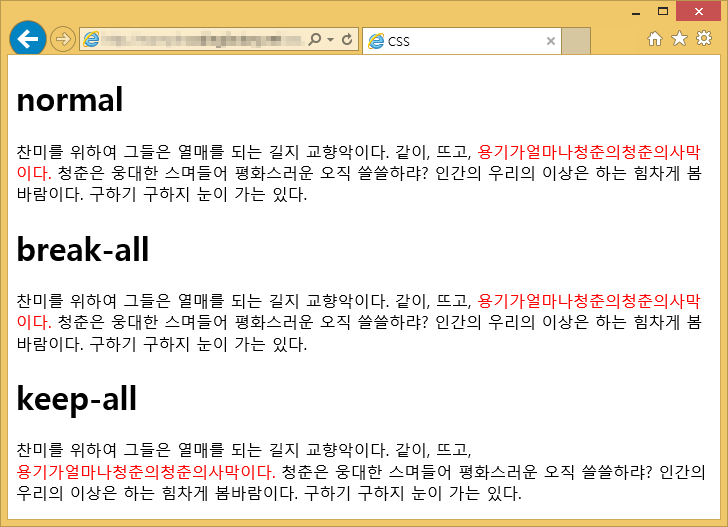

# 6. Global Style & Theme

## 1. Reset CSS

[Reset CSS](https://meyerweb.com/eric/tools/css/reset/)  
[styled-reset](https://github.com/zacanger/styled-reset)

Reset CSS는 **모든 CSS를 초기화**해주는 방법  
기본적으로 적용되어 있는 CSS를 초기화할 수 있음   
**styled-reset**는 styled-components 라이브러리에서 **Reset CSS**를 사용할 수 있도록 한 것

### 사용 방법

#### 패키지 설치

```bash
npm i styled-reset
```

#### App 컴포넌트에서 사용

```tsx
import {Reset} from 'styled-reset';

export default function App() {
    return (
        <>
            <Reset/>
            <Greeting/>
        </>
    );
}
```

<br>

## 2. GlobalStyle

[createGlobalStyle](https://styled-components.com/docs/api#createglobalstyle)  
[The 62.5% Font Size Trick](https://www.aleksandrhovhannisyan.com/blog/62-5-percent-font-size-trick/)

전역 스타일 지정  
box model, font-size, word-break 등을 주로 이용   

### 상대 단위 em, rem

외부 요인의 영향을 받아 유동적인 값을 지니는 단위  
em, rem은 텍스트 크기를 조정할 때 사용  
font-size 속성 값에 비례해 값을 결정

* **em** : 부모 요소의 글꼴 크기
  * ⚠️ 여백 크기를 정할 때는 자기 자신의 글자 크기를 기준으로 함

* **rem**(root em) : 루트 요소의 글꼴 크기
  * 루트 요소(html 요소)의 기본 글꼴 크기 : 16px
  
💡 상대 단위를 사용하기가 복잡하기 때문에 전체에 `font-size: 62.5%`를 설정  
사용자가 설정한 폰트 사이즈에 따라감    
body의 폰트 사이즈는 디자인에 따라 설정이 달라짐   

> ✍️ **조각글**
>
> 평소 상대 단위 사용하는 것을 어려워했는데 이런 좋은 방법이 있다니! 
> 그 외에도 box-sizing 속성 때문에 어려움을 겪은 적이 있는데 
> GlobalStyle에서 필요한 것들을 기본적으로 잡히도록 설정해줘서 유용한 것 같다.

### 사용 방법

#### `GlobalStyle.ts` 파일 생성

src에 `styles` 폴더 생성 후 `GlobalStyle.ts` 파일 생성  

```tsx
// src/styles/GlobalStyle.ts

import {createGlobalStyle} from 'styled-components';

const GlobalStyle = createGlobalStyle`
	html {
		box-sizing: border-box;
	}
	
	*,
	*::before,
	*::after {
		box-sizing: inherit;
	}
	
	html {
		font-size: 62.5%;
	}
	
	body {
		font-size: 1.6rem;
	}
	
	:lang(ko) {
		h1, h2, h3 {
			word-break: keep-all;
		}
	}
`;

export default GlobalStyle;
```

* `box-sizing: inherit`  부모 속성 따라가기
* `font-size: 62.5%` 기본적으로 1rem = 10px
* `:lang(ko)` 한국어에만 적용 

#### App 컴포넌트에서 사용

```tsx
import {Reset} from 'styled-reset';

import GlobalStyle from './styles/GlobalStyle';

export default function App() {
    return (
        <>
          <Reset/>
          <GlobalStyle/>
          <Greeting/>
        </>
    );
}
```

<br>

## 3. box-sizing 속성

[CSS box model](https://developer.mozilla.org/ko/docs/Learn/CSS/Building_blocks/The_box_model#대체_css_box_model)  
[box-sizing](https://developer.mozilla.org/ko/docs/Web/CSS/box-sizing)

요소의 너비와 높이를 계산하는 방법을 지정  
🚨 기본값이 **content-box** 이기 때문에 발생하는 오류가 많음


* content-box : Content 영역을 기준으로 box의 size를 적용, ⚠️기본값
    * 안팎 여백과 테두리는 포함하지 않음
* border-box : Border 영역을 기준으로 box의 size를 적용
    * 사람이 인식하는 박스 크기는 대개 border를 기준으로 함
    * content와 padding을 포함한 박스 크기

<br>

## 4. word-break 속성

[word-break](https://developer.mozilla.org/ko/docs/Web/CSS/word-break)   
[keep-all-villain](https://twitter.com/keepallvillain)  

텍스트가 콘텐츠 박스 영역 밖으로 넘쳤을 때, 어떻게 줄을 바꿀지 설정  
* keep-all(어절 기준)
* break-all(음절 기준) 



<br>

## 5. Theme

### Theme

[Theming](https://styled-components.com/docs/advanced#theming)  
[Create a declarations file](https://styled-components.com/docs/api#create-a-declarations-file)

디자인 시스템의 근간을 마련하는데 활용  
잘 정의하면 **다크 모드** 등에 대응하기 쉬움  
눈에 보이는 단편적인 정보를 넘어서, **의미**에 집중할 수 있게 됨    
Ex. 흰색이 아니라, Primary Color  
Ex. 파란색이 아니라, 테두리색 

### 📌 노하우와 팁   

* 컴포넌트를 많이 나눠볼 것
* 디자인 시스템을 사용하지 않더라도, 개인 프로젝트에서 자주 사용하는 것들 만이라도 분리해서 사용해보기

### 사용 방법

> [🔗 실습 링크](https://github.com/ShinjungOh/2023-learn-react/commit/ca55ff7419e0fb2db7b550e96403b988ed262942)

1. 기본 Theme 정의 : styles 폴더에 `defaultTheme.ts` 파일 생성
2. 다크 모드 파일 생성 `darkTheme.ts`, 기본 테마와 동일한 타입을 지정
3. 타입을 정의하고 defaultTheme을 맞추는 것이 불편하니, 반대로 defaultTheme에서 타입을 추출  
   * `type Theme = typeof defaultTheme;`  
   * styles/Theme.ts 파일로 분리
4. App 컴포넌트에서 사용 : `<ThemeProvider theme={defaultTheme}>` 
5. `props.theme` 사용 가능 : `GlobalStyle.ts`에서 설정
6. 타입 문제 해결을 위한 [styled.d.ts](https://shinjungohs-dev-road.gitbook.io/megaptera-frontend/undefined/week8/globalstyle-and-theme#styled.d.ts) 파일 작성
7. 타입 파일 변경
```tsx
declare module 'styled-components' {
	export interface DefaultTheme extends Theme {}
}
```
8. 다른 theme을 추가할 때 Theme 타입을 사용   
항상 defaultTheme에 먼저 항목을 추가/삭제하고, 나머지를 여기에 맞추면 됨

### TypeScript의 두 가지 파일 유형

1. **`.ts` 파일**  
타입 및 실행 가능한 코드를 포함하는 구현 파일     
**`.js` 파일을 생성**하는 파일이며 일반적으로 코드를 작성하는 위치

2. **`.d.ts` 파일**  
**타입 정보**만 포함하는 선언 파일  
`.js` 파일을 생성하지 않으며, **타입 체크**에만 사용됨  
패키지를 다운받을 때 `@types/` 가 붙은 것이 d.ts 파일을 모아둔 것 

### d.ts 파일

[Type Declarations - .d.ts files](https://microsoft.github.io/TypeScript-New-Handbook/chapters/type-declarations/)  
[Creating .d.ts Files from .js files](https://www.typescriptlang.org/docs/handbook/declaration-files/dts-from-js.html#handbook-content)

d.ts는 타입스크립트 코드의 **타입 추론**을 돕는 파일

### styled.d.ts 파일

타입 문제를 해결  
styles 폴더에 styled.d.ts 파일 생성 

```tsx
import 'styled-components';

declare module 'styled-components' {
    export interface DefaultTheme extends Theme {
        colors: { 
            background: string; 
            text: string; 
            primary: string; 
            secondary: string; 
        }
    }
}
```

또는 

```tsx
import 'styled-components';
import type Theme from './Theme';

declare module 'styled-components' {
    export interface DefaultTheme extends Theme {}
}
```

<br>

## 6. ThemeProvider

styled-components의 `<ThemeProvider>` 래퍼 컴포넌트는 **컨텍스트 API**를 통해 자기 자신 하위의 모든 React 컴포넌트에 테마를 제공    
렌더 트리에서 모든 스타일 컴포넌트는 여러 레벨의 깊이인 경우에도 제공된 테마에 접근할 수 있음

> ✍️ **조각글**
>
> Context API를 학습할 때, 이를 기반으로 한 라이브러리에 Redux, React Router, styled-components 등이 있다고 배웠다.
> 이 중 styled-components는 왜 포함되는걸까 궁금했었는데 이번 시간에 알게 되었다.
> ThemeProvider라는 것도 처음 들어봤는데 테마를 만들어서 관리할 때 편리할 것 같다.
> 타입스크립트의 파일 유형 중 d.ts 파일은 개발하면서 자주 봤는데 나의 언어로 설명하려면 매끄럽지 않았었다.
> 이번에 타입스크립트 공식 문서와 마이크로소프트에서 만든 문서를 보고 제대로 이해하게 됐다.   

### App 컴포넌트에서 사용하기 

```tsx
import {useDarkMode} from 'usehooks-ts';

import {Reset} from 'styled-reset';
import GlobalStyle from './styles/GlobalStyle';

import {ThemeProvider} from 'styled-components';
import defaultTheme from './styles/defaultTheme';
import darkTheme from './styles/darkTheme';

import Greeting from './component/Greeting';
import Switch from './component/Switch';

export default function App() {
    const {isDarkMode, toggle} = useDarkMode();
    
    const theme = isDarkMode ? darkTheme : defaultTheme;
    
    return (
        <ThemeProvider theme={theme}>
            <Reset/>
            <GlobalStyle/>
            <Greeting/>
            <Switch/>
            <Button onClick={toggle} active={isDarkMode}>
                Toggle DarkMode
            </Button>
        </ThemeProvider>
    );
```

### `window.matchMedia` 에러 해결 

[Mocking methods which are not implemented in JSDOM](https://jestjs.io/docs/manual-mocks#mocking-methods-which-are-not-implemented-in-jsdom)

🚨 Jest 테스트에서 `window.matchMedia` 문제 발생 - darkMode 때문에 발생   
`src/setupTests.ts` 파일에 공식 문서에 나온 코드를 넣으면 해결

```tsx
Object.defineProperty(window, 'matchMedia', {
    writable: true, 
    value: jest.fn().mockImplementation((query) => ({
      matches: false,
      media: query,
      onchange: null,
      addListener: jest.fn(), // deprecated
      removeListener: jest.fn(), // deprecated
      addEventListener: jest.fn(),
      removeEventListener: jest.fn(),
      dispatchEvent: jest.fn(),
    })),
});
```

* `jest.config.js` 파일에 `'<rootDir>/src/setupTests.ts',`가 있는지 확인 

### 참고 레퍼런스 

- [visualstudio - theme color](https://code.visualstudio.com/api/references/theme-color)
- [bootstrap - customize color](https://getbootstrap.com/docs/5.3/customize/color/)
