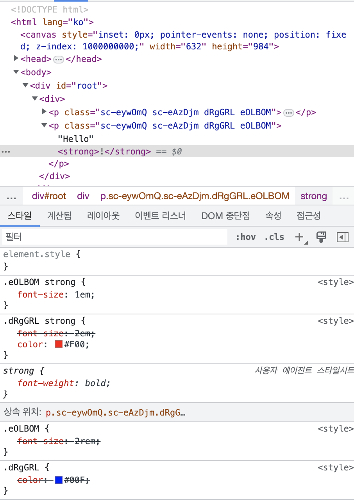

# 4. styled-components

## 1. styled-components

[styled-components](https://styled-components.com/)  
[@swc/plugin-styled-components](https://github.com/swc-project/plugins/tree/main/packages/styled-components)  

스타일이 적용된 컴포넌트(styled-component)를 쉽게 만들 수 있는 도구

> **🙋🏻‍♀️️ 주의 사항**
>
> 유명한 라이브러리들은 대부분 ‘왜’ 만들어졌는지 혹은 품고 있는 철학 등이 잘 정리되어 있는 경우가 많습니다.
> 라이브러리를 사용할 때는 공식문서를 꼭 살펴보는 습관을 들이는 것이 좋습니다.
>
> 💡 참고 레퍼런스 [styled-components basics](https://styled-components.com/docs/basics)


📌 [IDE 플러그인](https://marketplace.visualstudio.com/items?itemName=styled-components.vscode-styled-components) 
설치해서 사용할 것 - 스타일 코드를 문자열로 인식해서 아무런 구분이 안 되는데, 플러그인 설치하면 CSS임을 인식  
📌 [Babel Plugin](https://styled-components.com/docs/tooling#babel-plugin) 을
SWC에서 쓸 수 있도록 포팅한 것도 함께 설치할 것(SSR 지원 등을 위한 공식 권장사항)

### 장점

1. **자동 중요 CSS**  
페이지에 렌더링되는 컴포넌트를 추적하고 해당 스타일만 자동 적용, 사용자가 필요한 최소한의 코드를 로드
2. **클래스 이름 버그 없음**  
고유한 클래스 이름을 생성하기 때문에 중복, 겹침 또는 맞춤법 오류 방지 
3. **손쉬운 CSS 삭제**    
스타일이 특정 컴포넌트에 연결되어 있기 때문에, 컴포넌트가 삭제되면 모든 스타일도 함께 삭제됨 
4. **간단한 동적 스타일링**    
클래스를 수동으로 관리할 필요 없이, props 또는 global theme을 기반으로 스타일을 조정하는 것이 간단하고 직관적
5. **유지 보수 용이**    
컴포넌트에 영향을 주는 스타일을 찾기 위해 여러 파일을 뒤질 필요가 없음
6. **자동 벤더 프리픽스**    
CSS를 현재 표준에 맞게 작성하고, 나머지는 스타일 컴포넌트가 처리

## 2. 사용 방법

### 패키지 설치

```bash
npm i styled-components

npm i -D @types/styled-components @swc/plugin-styled-components
```

### `.swcrc` 파일 작성

```
{
    "jsc": {
        "experimental": {
            "plugins": [
                [
                    "@swc/plugin-styled-components",
                    {
                        "displayName": true,
                        "ssr": true
                    }
                ]
            ]
        }
    }
}
```

### 간단한 Styled Component 만들기

```tsx
import styled from 'styled-components';

const Paragraph = styled.p`
    color: #00F;
    
    strong {
        font-size: 2em;
    }
`;

export default function Greeting() {
    return (
        <Paragraph>
            Hello, world
            <strong>!</strong>
        </Paragraph>
    );
}
```

* 브라우저에서는 class로 변환, 인라인 스타일이 아니라 CSS   
* 💡 **styled** 가 class를 추가해줌  
`<p class="sc-bgqQcB fSBjJp">Hello!</p>`  
sc는 styled-components 를 의미
* **중첩(nested)** 을 지원  
해당 컴포넌트의 하위 태그에만 적용되는 것  

### 상속 받아 추가로 스타일 입히기 

컴포넌트를 상속받아 중복을 줄이고 추가로 스타일링 

```tsx
import styled from 'styled-components';

const Paragraph = styled.p`
    color: #00F;
`;

const BigParagraph = styled(Paragraph)`
    font-size: 2rem;
	
    strong {
        font-size: 1em;
    }
`;

export default function Greeting() {
    return (
        <BigParagraph>
            Hello, world!
        </BigParagraph>
    );
}
```



* 상속받은 값을 덮어쓸 수 있음  

### 기존 컴포넌트에 스타일 입히기

> [🔗 실습 링크](https://github.com/ShinjungOh/2023-learn-react/commit/b4f3a8057a2f17e0980f0894cf4de8689ab133a6)

⚠️ 기존 컴포넌트가 Class를 잡아줘야 한다는 점에 주의  
**styled** 가 class를 추가해주기 때문에, **className**을 받아서 처리해야 함  
className은 원래 존재하는 속성이기 때문에 `React.HTMLAttributes<HTMLElement>` 타입으로 설정하면 됨  

```tsx
import styled from 'styled-components';

function HelloWorld({className}: React.HTMLAttributes<HTMLElement>) {
    return (
        <p className={className}>
            Hello, world!
        </p>
    );
}

const Greeting = styled(HelloWorld)`
    color: #00F;
 `;

export default Greeting;
```

> ✍️ **조각글**
>
> `styled`가 어떤 역할을 하는지 모르고 있었는데, 브라우저에서 class로 변환되도록 class를 생성해준다는 것을 처음 알게 되었다.
> 이런 이유로 기존 컴포넌트에 스타일을 주려면 `className`을 넘겨주도록 해야한다. 처음 강의를 들을 때는 이해가 잘 안됐는데
> 몇 번 반복해서 들으니 깨닫는 순간이 왔다. 
