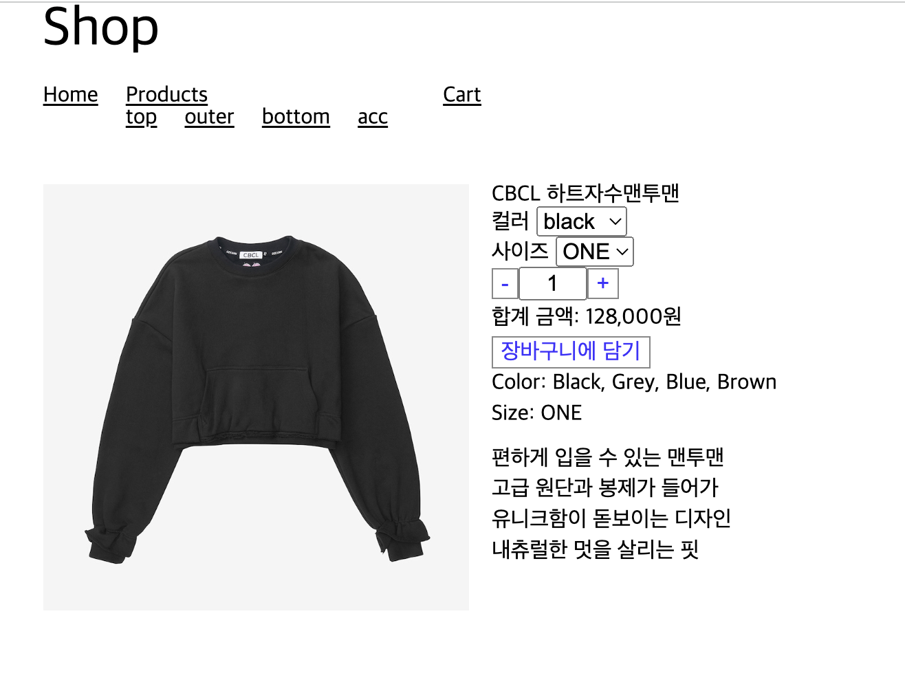

# 5. 장바구니에 상품 담기

## 장바구니에 상품 담기

> [🔗 실습 링크 : 장바구니에 상품 담기 수량 조절, 가격 표시 구현](https://github.com/ShinjungOh/2023-learn-react/commit/58fbde66732b3e23dff7804372c0b45b3b351dc4)  
> [🔗 실습 링크 : 장바구니에 상품 담기 버튼 구현, Price 컴포넌트 리팩토링](https://github.com/ShinjungOh/2023-learn-react/commit/9f61549ea7b2aa34c51e2f681ff4e2c5565d1a2f)  
> [🔗 실습 링크 : 장바구니에 상품 담기 옵션 선택 구현](https://github.com/ShinjungOh/2023-learn-react/commit/3acb472c300292b99130408f6a543a40e21ee416)  

🎯 장바구니에 상품 담기 기능 구현하기   



> 🛒 **`장바구니에 상품 담기`의 의미** 
> 
> 정확히는 Product가 Cart로 들어가는 것이 아니라, Product와 관련된 Option 정보, 수량 등 다양한 값이 조합돼 Cart의 Line Item을 구성하는 것
> 
> 실제로는 조금 복잡한 도메인 로직이 들어갈 수 있는데, 이런 처리는 백엔드에서 담당하기로 하자.    
> 현업에서는 백엔드와 협업할 때, 어떤 방식으로 데이터를 넘겨주면 좋은지 먼저 소통을 하면 좋음  
> 여기서는 상품과 관련된 **옵션, 수량** 등을 컨트롤하는데 집중할 것  


### `AddToCartForm.tsx` 컴포넌트 작성

* src/components/product-detail/form

#### 구현 내용 

1. 옵션을 보여주고, 선택하기 
2. 수량 정하기 (기본값: 1)
3. 수량에 맞는 비용 보여주기
   * 단가 보여주기
   * 추가 가능 작업 : 할인가, 정상가, 쿠폰 적용가 등 
4. `장바구니에 담기` 버튼이 있고, 클릭 시 장바구니에 담았다는 메시지로 교체  
    * UX 관련 파트 : 다양한 방법 존재 
    * 타임아웃으로 기존 페이지로 돌아가게 처리
    * 팝업 모달 띄우기

```tsx
export default function AddToCartForm() {
  return (
    <div>
      <Options />
      <Quantity />
      <Price />
      <SubmitButton />
    </div>
  );
}
```

* Prop Drilling을 피하기 위해 전부 개별 컴포넌트에서 Store를 가져다 쓰도록 구현 
* 부모 컴포넌트에서 props를 내려줘도 되지만, 복잡해질 가능성이 커서 내부에서 처리

### Quantity 컴포넌트 작성

```tsx
export default function Quantity() {
  const [{ quantity }, store] = useProductFormStore();

// +, - 함수 생성 
   
  return (
    <Container>
      <Button onClick={handleClickDecrease}>-</Button>
      <input type="text" value={quantity} readOnly />
      <Button onClick={handleClickIncrease}>+</Button>
    </Container>
  );
}
```

* 숫자를 직접 입력하는 것은 불가
* 버튼만 이용해서 수량을 조절하도록 구현 

### 공통으로 사용할 Button 컴포넌트 생성 

* 공통 UI는 ui 폴더를 만들어서 관리하면 좋음 
* src/components/ui

```tsx
import styled from 'styled-components';

const Button = styled.button.attrs({
  type: 'button',
})`
  border: .1rem solid #888;
  background: transparent;
  color: ${(props) => props.theme.colors.primary};
  cursor: pointer;
`;

export default Button;
```

### useProductFormStore hook 생성

* src/hooks

```tsx
export default function useProductFormStore() {
  const store = container.resolve(ProductFormStore);
  return useStore(store);
}
```

### ProductFormStore 생성 

* src/stores

```tsx
@singleton()
@Store()
export default class ProductFormStore {
  quantity = 1;

  @Action()
  changeQuantity(quantity: number) {
    if (quantity <= 0) {
      return;
    }
    if (quantity > 10) {
      return;
    }
    this.quantity = quantity;
  }
}
```

### 테스트 작성하기 

사소한 비즈니스 로직이지만, 테스트 코드를 통해 검증할 것 

> 💡 **테스트를 하기 어려운 상황일 때 최소한의 방법**
> 
> 설계에서 비즈니스 로직과 UI를 분리하고, **비즈니스 로직**을 중점으로 테스트   
> 리액트와 완전히 분리하면 jest와 typescript만 가지고 테스트를 작성할 수 있음  
> 테스트가 깔끔, 단순해지고 오래 감

```tsx
describe('ProductFormStore', () => {
  let store: ProductFormStore;

  beforeEach(() => {
    store = new ProductFormStore();
  });

  describe('changeQuantity', () => {
    context('with correct value', () => {
      it('changes quantity', () => {
        store.changeQuantity(3);

        expect(store.quantity).toBe(3);
      });
    });

    context('with incorrect value', () => {
      it("doesn't changes quantity", () => {
        store.changeQuantity(-1);
        store.changeQuantity(11);

        expect(store.quantity).toBe(1);
      });
    });
  });
});
```

### Price 컴포넌트 작성

```tsx
export default function Price() {
  const [{ product }] = useProductDetailStore();
  const [{ quantity }] = useProductFormStore();

  return (
    <Container>
      {numberFormat(product.price * quantity)}원
    </Container>
  );
}
```

### Getter 이용하기  

ProductFormStore에 수량에 따른 금액을 계산하는 메서드 또는 Getter가 있다면 다른 형태로 접근할 수도 있음 

```tsx
export default function Price() {
  const [{ product }] = useProductDetailStore();
  const [{ price }, productFormStore] = useProductFormStore();

  // TODO: product 변경에 따른 setProduct 호출은 여기가 아니라 page 등에서 처리할 것!
  useEffect(() => {
    productFormStore.setProduct(product);
  }, [productFormStore, product]);

  return (
    <Container>
      {numberFormat(price)}원
    </Container>
  );
}
```

* src/stores/ProductFormStore.ts

**복잡한 로직**의 경우 이런 방식으로 구현하면 깔끔해짐    
**할인, 쿠폰 적용가** 등을 처리할 수 있음

```tsx
get price() {
    return this.product.price * this.quantity;
}
```

### SubmitButton 컴포넌트 작성

```tsx
export default function SubmitButton() {
  const [{ done }, store] = useProductFormStore();

  const handleClick = () => {
    store.addToCart();
  };

  if (done) {
    return (
      <p>장바구니에 담았습니다</p>
    );
  }

  return (
    <Button onClick={handleClick}>
      장바구니에 담기
    </Button>
  );
}
```

### Store에 addToCart 및 상태 추가

장바구니에 상품을 담기 위해 관리해야 할 여러 상태가 필요

```tsx
@singleton()
@Store()
export default class ProductFormStore {
  productId = '';

  options: ProductOption[] = [];

  selectedOptionItems: ProductOptionItem[] = [];

  quantity = 1;

  done = false;

  async addToCart() {
    // 
  }
   @Action()
   //
}
```

```tsx
async addToCart() {
  this.resetDone();

  await apiService.addProductToCart({
    productId: this.productId,
    options: this.options.map((option, index) => ({
      id: option.id,
      itemId: this.selectedOptionItems[index].id,
    })),
    quantity: this.quantity,
  });

  this.complete();
}
```

#### @Action()

* setProduct(product: ProductDetail) {}
* changeQuantity(quantity: number) {}
* resetDone() {}
* complete() {}


### API Service에 addProductToCart 추가

```tsx
async addProductToCart({ productId, options, quantity }: {
  productId: string;
  options: {
    id: string;
    itemId: string;
  }[];
  quantity: number;
}): Promise<void> {
  await this.instance.post('/cart/line-items', {
    productId, options, quantity,
  });
}
```

### Options 컴포넌트 작성 

```tsx
export default function Options() {
  const [{ options, selectedOptionItems }, store] = useProductFormStore();

  const handleChange: ChangeFunction = ({ optionId, optionItemId }) => {
    store.changeOptionItem({ optionId, optionItemId });
  };

  return (
    <div>
      {options.map((option, index) => (
        <Option
          key={option.id}
          option={option}
          selectedItem={selectedOptionItems[index]}
          onChange={handleChange}
        />
      ))}
    </div>
  );
}
```

### Option 컴포넌트 작성 

복잡한 로직을 분리해서 처리 


### 범용 ComboBox 컴포넌트 작성 

* src/components/ui


### Store에 changeOptionItem 추가

* src/stores/ProductFormStore.ts

```tsx
@Action()
changeOptionItem({ optionId, optionItemId }: {
  optionId: string;
  optionItemId: string;
}) {
   this.selectedOptionItems = this.product.options.map((option, index) => {
      const item = this.selectedOptionItems[index];
      return option.id !== optionId
              ? this.selectedOptionItems[index]
              : option.items.find(i => i.id === optionItemId) ?? option.items[0];
   });
}
```

* 찾는 값을 못 찾았을 경우 초기값으로 설정
* [Array를 Immutable하게 변경하기](https://github.com/ahastudio/til/blob/main/javascript/immutable-array.md)
