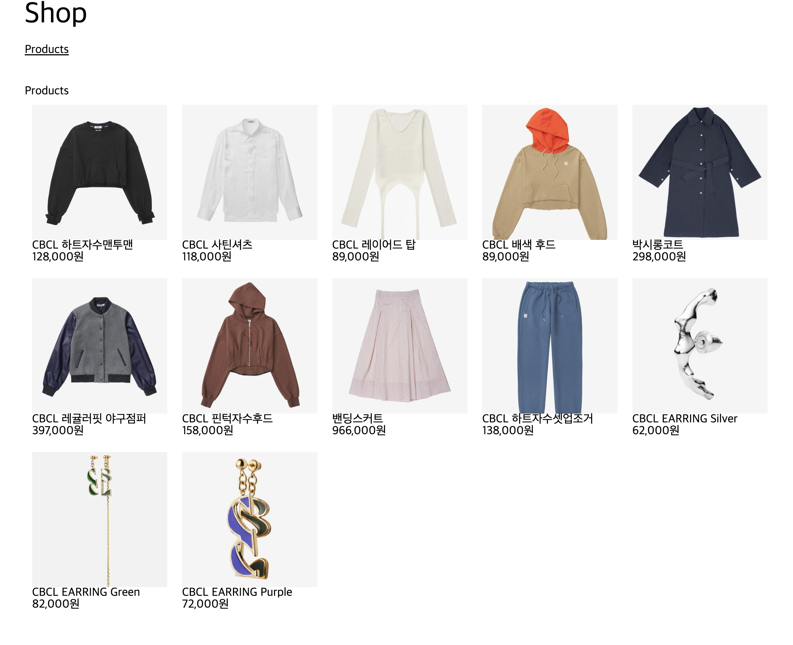
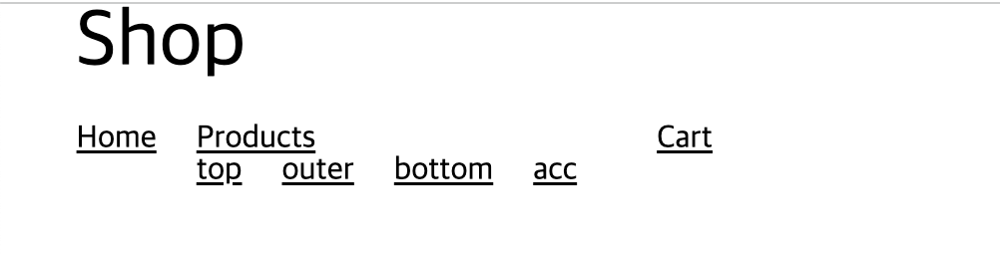
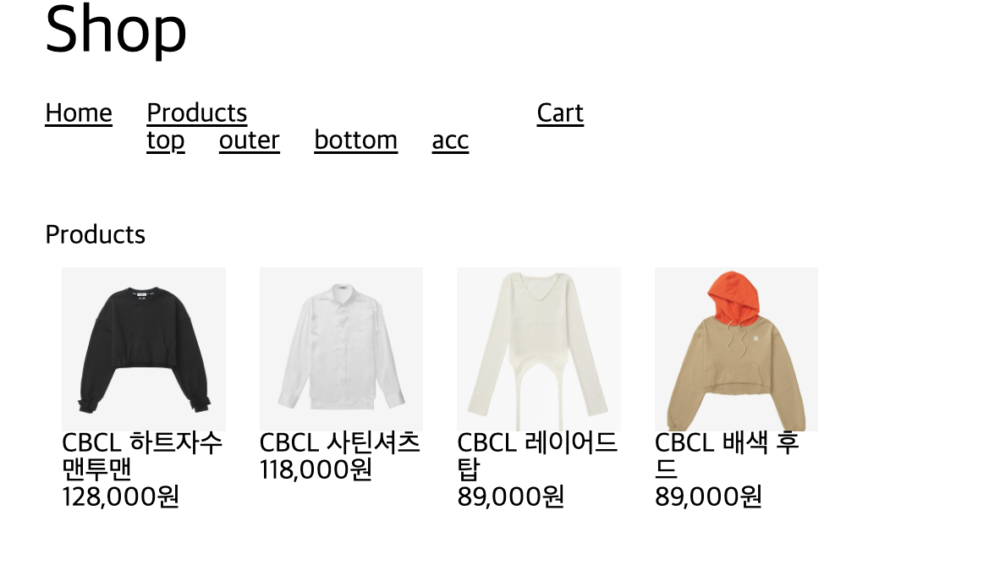

# 2. 목록 보기

## 1. 상품 목록

> [🔗 실습 링크 : useFetchProducts hook 구현](https://github.com/ShinjungOh/2023-learn-react/commit/cb5eebec28342d8d38bb61d0a020e7b11fc7638d)  
> [🔗 실습 링크 : Products UI 구현](https://github.com/ShinjungOh/2023-learn-react/commit/b2b5b9a697d61eb1c2e3e486036fb47763244470)  
> [🔗 실습 링크 : ProductsStore 적용](https://github.com/ShinjungOh/2023-learn-react/commit/96ec76f853f709ee63b7c68254c3e3d1f6f8130b)

🎯 **상품 목록을 얻어서** 표시하는 **화면을 만들기**

1. 상품 목록 얻기 - API 서버에서 
2. 상품 목록 보여주기 - React로 

전자는 useFetchProducts 훅으로, 
후자는 Products 컴포넌트로 구현하고, ProductListPage에서 이 둘을 조합

* 단일 책임 원칙 
* 테스트 용이



### ProductListPage 구현 

```tsx
// ProductListPage.tsx

import Products from '../components/product-list/Products';

import useFetchProducts from '../hooks/useFetchProducts';

export default function ProductListPage() {
    // Todo 1. 상품 목록 얻기
    const { products } = useFetchProducts();

    // Todo 2. 화면에 보여주기
    return (
        <div>
            <h2>Products</h2>
            <Products products={products} />
        </div>
    );
}
```

### useFetchProducts hook 생성 

```tsx
// hooks/useFetchProducts.ts

const apiBaseUrl = 'https://shop-demo-api-01.fly.dev';

export default function useFetchProducts() {
    type Data = { 
        products: ProductSummary[]; 
    };

    const { data } = useFetch<Data>(`${apiBaseUrl}/products`);

    return {
        products: data?.products ?? [], 
        loading: !data, 
        error,
  };
}
```

* BaseUrl은 추후 환경 변수로 분리 : 재활용과 유지보수가 쉬워짐 
* 필요한 경우 loading과 error를 같이 내보낼 수 있음 

### Products 컴포넌트 구현 

Product 컴포넌트 분리 

```tsx
type ProductsProps = {
  products: ProductSummary[];
}

export default function Products({ products }: ProductsProps) {
  if (!products.length) {
    return null;
  }

  return (
    <Container>
      <ul>
        {products.map((product) => (
          <li key={product.id}>
            <Link to={`/products/${product.id}`}>
              <Product product={product} />
            </Link>
          </li>
        ))}
      </ul>
    </Container>
  );
}
```

### numberFormat 유틸리티 함수 구현  

[Intl.NumberFormat](https://developer.mozilla.org/ko/docs/web/javascript/reference/global_objects/intl/numberformat)

언어에 맞는 숫자 서식을 지원하는 객체의 생성자

> 🌎 [Intl](https://developer.mozilla.org/ko/docs/Web/JavaScript/Reference/Global_Objects/Intl)  
> 각 언어에 맞는 문자비교, 숫자, 시간, 날짜비교를 제공하는, ECMAScript 국제화 API를 위한 네임 스페이스  
> 원하는대로 커스텀이 가능 

숫자를 읽기 좋게 보여주도록 numberFormat 유틸리티 함수를 준비  
간단한 유틸 함수이기 때문에 테스트도 같이 작성 

```tsx
export default function numberFormat(value: number) {
  return new Intl.NumberFormat().format(value);
}
```

### 상품 목록을 Store로 관리

> [🔗 참고 자료](https://shinjungohs-dev-road.gitbook.io/megaptera-frontend/undefined/week6/tsyringe)

```tsx
// stores/ProductsStore.ts

const apiBaseUrl = '...';
    
@singleton()
@Store()
export default class ProductsStore {
  products: ProductSummary[] = [];

  async fetchProducts() {
    this.setProducts([]);

    const { data } = await axios.get(`${apiBaseUrl}/products`);
    const { products } = data;

    this.setProducts(products);
  }

  @Action()
  setProducts(products: ProductSummary[]) {
    this.products = products;
  }
}
```

* reflect-metadata import
* tsconfig.json 파일에 decorator 설정 주석 해제

### useFetchProducts hook 변경

```tsx
export default function useFetchProducts(): {
  products: ProductSummary[];
} {
  const store = container.resolve(ProductsStore);

  const [{ products }] = useStore(store);

  useEffectOnce(() => {
    store.fetchProducts();
  });	

  return { products };
}
```

<br>

## 2. 카테고리 목록

> [🔗 실습 링크 : useFetchCategories hook 및 CategoriesStore 구현, ApiService 분리](https://github.com/ShinjungOh/2023-learn-react/commit/cd2ad6831dd5d318fd6f59cbbfb2baa48827d235)

🎯 헤더에서 **카테고리 목록**을 표시하기 



### Header에 카테고리 목록 보여주기 

```tsx
export default function Header() {
  const { categories } = useFetchCategories();

  return (
    <Container>
      <h1>Shop</h1>
      <nav>
        <ul>
          <li>
            <Link to="/">Home</Link>
          </li>
          <li>
            <Link to="/products">Products</Link>
            {!!categories.length && (
              <ul>
                {categories.map((category) => (
                  <li key={category.id}>
                    <Link to={`/products?categoryId=${category.id}`}>
                      {category.name}
                    </Link>
                  </li>
                ))}
              </ul>
            )}
          </li>
          <li>
            <Link to="/cart">Cart</Link>
          </li>
        </ul>
      </nav>
    </Container>
  );
}
```

### useFetchCategories hook 생성

`hooks/useFetchCategories.ts`  
useFetchProducts 복사해서 수정하면 편리  

### Store 구현 

```tsx
// stores/CategoriesStore.ts

@singleton()
@Store()
export default class CategoriesStore {
  categories: Category[] = [];

  async fetchCategories() {
    this.setCategories([]);

    const categories = await apiService.fetchCategories();

    this.setCategories(categories);
  }

  @Action()
  setCategories(categories: Category[]) {
    this.categories = categories;
  }
}
```

### ApiService 파일 분리 

services 폴더에 API 호출을 모아주는 ApiService 파일을 생성   
API의 **base URL**을 지정하기 위해 환경변수를 활용

```tsx
const API_BASE_URL = process.env.API_BASE_URL || 'https://...';

export default class ApiService {
  private instance = axios.create({
    baseURL: API_BASE_URL,
  });

  async fetchCategories(): Promise<Category[]> {
    const { data } = await this.instance.get('/categories');
    const { categories } = data;
    return categories;
  }

  async fetchProducts(): Promise<ProductSummary[]> {
    const { data } = await this.instance.get('/products');
    const { products } = data;
    return products;
  }
}

export const apiService = new ApiService();
```

* ProductsStore 에서도 코드 수정

<br>

## 3. 카테고리별 상품 목록

> [🔗 실습 링크 : 카테고리별 상품 목록 보기 구현](https://github.com/ShinjungOh/2023-learn-react/commit/cc2920e75f0d92453743d984dc7a1aea5b4eff9e)  
> [🔗 실습 링크 : codecept 설치 및 routes, product list 테스트](https://github.com/ShinjungOh/2023-learn-react/commit/edc98492b40d496028b0f665c3bfefe5e6741731)

🎯 카테고리 클릭 시 **해당 카테고리 상품** 보여주기 

처음부터 고민해서 바로 만들어도 되고, 일단 만들고 고쳐나가도 됨  
테스트 코드를 작성하면서 하면 오류를 줄일 수 있음 



### useSearchParams

[React Router - useSearchParams](https://reactrouter.com/en/main/hooks/use-search-params)

현재 위치에 대한 URL의 쿼리 문자열을 읽고 수정하는 데 사용  
React의 useState와 비슷하게, 현재 위치의 **검색 매개변수**와 이를 **업데이트하는 데 사용하는 함수**의 배열을 반환

```
// 참고 
window.location.search
```

### ProductListPage에서 categoryId 얻어오기 

```tsx
export default function ProductListPage() {
  const [params] = useSearchParams();

  const categoryId = params.get('categoryId') ?? undefined;

  const { products } = useFetchProducts({ categoryId });

  return (
    <div>
      <h2>Products</h2>
      <Products products={products} />
    </div>
  );
}
```

* Id가 없으면 null을 반환하는데, 여기서는 일부러 undefined 사용(있을 수도, 없을 수도 있음) 

### 카테고리 ID를 쓰도록 hook 변경

```tsx
export default function useFetchProducts({ categoryId }: {
  categoryId: string;
}): {
  products: ProductSummary[];
} {
  const store = container.resolve(ProductsStore);

  const [{ products }] = useStore(store);

  useEffect(() => {
    store.fetchProducts({ categoryId });
  }, [store, categoryId]);

  return { products };
}
```

* 카테고리 ID가 바뀔 때마다 리렌더되야 하므로 `useEffect`를 사용 
* useFetchCategories 도 `useEffect`를 사용하고 의존성 배열에 store 추가 

### Store 변경

```tsx
async fetchProducts({ categoryId }: {
  categoryId?: string;
}) {
  this.setProducts([]);

  const products = await apiService.fetchProducts({ categoryId });

  this.setProducts(products);
}
```

### API Service 변경

```tsx
export default class ApiService {
    async fetchProducts({categoryId}: { 
        categoryId?: string; 
    } = {}): Promise<ProductSummary[]> {
        const {data} = await this.instance.get('/products', {
            params: {categoryId},
        });
        const {products} = data;
        return products;
    }
}
```

* axios는 params를 넘겨줄 수 있음
